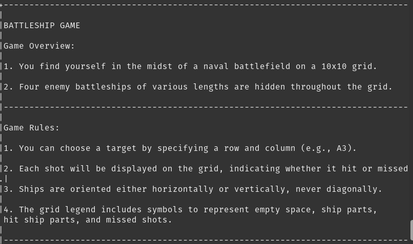

# Battelship Game

The Battleship Game is a classic strategy and guessing game where you find yourself in the midst of a 10x10 grid, taking place in a Terminal.
Your mission is to locate and sink four enemy battleships hidden throughout the grid. Engage in a strategic one-player battle against the computer and try to secure victory.

Are you ready to give it a try? <a href="https://dfcmk.github.io/Quiz-Game/">Battleship Game</a>

## Table of Content

- <a href="#user-experience-ux">User Experience UX</a>
  - [User Stories](#user-stories)
  - [Owner Stories](#owner-stories)
  - [Game rules](#game-rules)
  - [Legend](#legend)
  - [Gameplay](#gameplay)
  
- <a href="#design-choices">Design Choices</a>

  - [Arrangement of Grids](#arrangement-of-grids)
  - [Game moves](#game-moves)

- <a href="#features">Features</a>
  - <a href="#existing-features">Existing Features:</a>
    - [Grid Display](#grid-display)
    - [Turn Notifications](#turn-notifications)
    - [Hit and Miss Feedback](#hit-and-miss-feedback)
    - [Game Introduction](#game-introduction)
    - [Exit Option](#exit-option)
    - [Player Interaction and Playername](#player-Interaction-and-playername)

  - <a href="#features">Future Features</a>
   
- <a href="#technologies-used">Technologies Used</a>
  - [Libraries Used](#libraries-used)

- [Testing](#testing)
  - [Bugs](#bugs)

- [Deployment](#deployment)

- [Credits](#credits)

  - [Code](#code)
  
- [Acknowledgements](#acknowledgements)

## User Experience UX

### User Stories:
- As a user i want to see my own ships on my grid
- As a user i want to see the letters or numbers above the columns and rows, so i can make an accurate decision which cell to target. 
- As a user, I want to get notified about the turns, whether it is my turn or the computer's turn.
- As a user, I want to get visual signs and text updates that let me know if I got a hit or miss.
- As a user i want get informed which grid is for which purpose if there are more then one.
- As a user i want to have an option to exit the game at any time
- As a user i want get a brief introduction to the game and its rules

<a href="#table-of-content">Back to top</a>

### Owner Stories:
- As an owner I want to ensure the data entered is correct and valid.
- As an owner i want ensure that the game is functional and playable from begining to end.

### Game Rules:
1. The game takes place on a 10x10 grid.
2. Four enemy battleships of various lengths are hidden on the grid.
3. Players take turns choosing target coordinates (e.g., A3) to attack the computer's grid.
4. Each shot will be displayed on the grid, indicating whether it hit or missed.
5. Ships are oriented either horizontally or vertically, never diagonally.
6. The grid legend includes symbols for empty space, ship parts, hit ship parts, and missed shots.

<a href="#table-of-content">Back to top</a>

### Legend:
1. ' . ' : Empty space on the grid.
2. 'B' (Battleship), 'S' (Submarine), 'C' (Carrier): Ship types. 
3. '@': Part of a battleship hit by a bullet.

### Gameplay:
1. Get player name before the game start.
2. Ships are randomly placed on both grids, player and the computer's grid. 
3. Take turns choosing coordinates to strike and try to hit the computer's ships, by entering coordinates in the format A1 to J10.
4. The game continues until all enemy ships are sunk or the computer sinks all of the player's ships.

<a href="#table-of-content">Back to top</a>

## Design Choices

### Arrangement of Grids:

The game consists of two grids: the player's grid and the opponent's grid. The player's grid is positioned beneath the opponent's grid. This design is inspired by real battleship game grids, where the player has their own grid below the opponent's. The player must mark the opponent's shots on their own grid and note the coordinates they have attacked on the opponent's grid above.

The screenshot below illustrates how the grids are aligned: 

<a href="#table-of-content">Back to top</a>

### Game moves:

The text-form updates for game moves are displayed beneath both grids, with each message separated by a separator line for better readability.

For a visual representation refer to the screenshot below:
 

<a href="#table-of-content">Back to top</a>

## Features:

### Existing Features:
  #### Grid Display:
  - Player's grid and opponent's grid are presented.
  - Player's ships are visible on their grid.
  - Letters and numbers above columns and rows for easy reference.
  
  Player's grid:

  

  Opponent's grid from player's perspective:

  

  <a href="#table-of-content">Back to top</a>

#### Turn Notifications: 

- Player get notified whose turn it is (Player or Computer):

  

  <a href="#table-of-content">Back to top</a>

#### Hit and Miss Feedback:
- Visual signs and text updates indicate hits ('@') and misses ('X'):

  

  <a href="#table-of-content">Back to top</a>

  #### Game Introduction:
- Brief introduction to the game and its rules for the user:

  
  
  

  #### Exit Option: 
- Users can exit the game at any time using a designated command:

  

  <a href="#table-of-content">Back to top</a>

  #### Player Interaction and Playername: 

  
<a href="#table-of-content">Back to top</a>
  

### Future Features:
Potential future features could include allowing the user to choose the number of ships to place on their and the computer's grid, as well as adjusting the grid size for both the user's and the opponent's grid to suit their preferences.

<a href="#table-of-content">Back to top</a>

## Technologies Used

- <a href="https://html.spec.whatwg.org/" rel="nofollow">Python</a>: primary language of the application.

- <a href="https://github.com/" rel="nofollow">Github</a>:  to host the repositories.

- <a href="https://code.visualstudio.com/ used to deploy the website." rel="nofollow">VS Code</a>: Used as the code editor to write and edit the website's code.

<a href="#table-of-content">Back to top</a>

### Libraries Used:
The Battleship game utilizes only one fundamental library, the random library.

## Testing
Testing of the code revealed no major errors. Although I attempted to use <a href="pep8online.com">PEP8</a> for code validation, the site didn't work for me. Instead, I used <a href="https://extendsclass.com/python-tester.html">PEP8</a>, which provides information about syntax errors.

### Bugs
  #### Resolved Bugs: 
- The problem was tied to the computer's move selection mechanism during the game. When a row was entirely filled, the computer continued to attempt a move within that row, leading to the game getting stuck. This occurred because the program was waiting for the computer to make its move.

The screenshot below illustrates the issue. 

Game wait for Computer's turn:

- The cause of the issue was that the while True loop was creating an infinite loop due to the absence of a clear exit condition. The loop was repeatedly selecting a random row and column, without taking into account whether the chosen row had already been fully hit.

The screenshot below shows the code snippet in the enemy_move function, which was responsible for this behavior:

- to resolve this i added an if statement to the initial move selection loop which checks first if all rows have been hit, if so it return None.
Then it choose a random cell on the grid and check if the cell has already been attacken with comparing the attacked cells written to attacked_rows and attacked_cols as a list. If it is not matching a cell already been in attacked_row and attacked_col, the computer finaly makes it's move:

#### Unresolved Bugs:
- **Incomplete Grid Recognition:**
  There was an issue where the program incorrectly identified that all cells on the grid were hit when a diagonal or vertical row was completed, including one cell from the last row (J). The screenshots below illustrate this issue: 

- **Solution:**
  To address this issue, the grid size was extended from 10x10 to an 11x11 grid. The last row (K) was hidden by using [:-1] when accessing grid rows, and the 11th column was hidden by starting the range function from 1. The `play_game` function was updated to end the game when all ships from the computer or the player were sunk.

- **Compromised Computer Guessing:**
  The solution to the incomplete grid recognition introduced another problem where the computer makes guesses within the 11th column and the last row (K), which are not displayed on the grid. This was implemented to create a frame around the actual grid to prevent the game from prematurely ending when a diagonal or vertical row extended to the last row (J). As a consequence, the computer always has fewer hits on the visible grid than the player, making it unlikely for the player to lose. While this solution is suboptimal, an alternative resolution has not been found yet.

Modified print grid functions: 

- **Place_ship Function Modification:**
Another modification was made in the place_ship function. An if statement was added to ensure that ship parts won't get placed into the phantom row (K) and the phantom column 11.

- **Conclusion:**
To summarize, the above-described approach resolved most of the issues except for avoiding the computer guesses within the phantom row (K) and phantom column 11. Fixing this in the near future is necessary to enhance the user experience.

## Deployment

#### Deploy to <a href="www.heroku.com">Heroku</a>:
<!--Adjust here with rewriting the steps -->
1. Ensure your requirements.txt file has the required dependencies. To do this you can use the following code in your IDE:
   - 
pip3 freeze &gt; requirements.txt

   -  Heroku will use this file to import the dependencies that are required. 

2. Create or Login to your Heroku account.

3. Navigate to Dashboard.

4. Click "New" and select "create new app" from the drop-down menu. This is found in the upper right portion of the window.

5. Provide a unique name for your application and select your region.

6. Click on "Create App". 

<a href="#table-of-content">Back to top</a>

To get to the live link of the Battelship Application on Heroku - click here: <a href="https://battleship-game800-ac274e926044.herokuapp.com/">https://battleship-game800-ac274e926044.herokuapp.com/</a>

#### Setting up the App with Heroku:

1. Navigate to the "Settings" section of your application and scroll down to find the "Buildpacks" section.
2. Click on "Buildpacks". Then, select both "Python" and "Node.js" by clicking on them. Note that the order in which you add these buildpacks matters. The Python buildpack should be added first, followed by the Node.js buildpack. This is because Heroku executes the buildpacks in the order they are listed.
3. To ensure that the Python buildpack is above the Node.js buildpack, you can click and drag the packs to rearrange them. Drag the Python buildpack to the top and the Node.js buildpack below it.
4. Next, you need to add configuration variables. If your application uses an API like Google Sheets, add CREDS as the key and the content of your .json file as the value. Click 'Add' after entering these details.
5. If you don't work with an API you only need to add PORT, set PORT as the key and 8000 as the value. If you don't do this, your project might fail to deploy.

<a href="#table-of-content">Back to top</a>

#### App Deployment:
1. Navigate to the "Deploy" section.
2. Scroll down to "Deployment Method" and select "GitHub".
3. Authorise the connection of Heroku to GitHub.
4. Search for your GitHub repository name, and select the correct repository
5. For Deployment there are two options, Automatic and Manual Deployment.

   -  Automatic Deployment: This will prompt Heroku to re-build your app each time you push your code to GitHub.
   - Manual Deployment: This will only prompt Heroku to build your app when you manually tell it to do so.

6. Ensure the correct branch is selected "master/Main", and select the deployment method that you desire.

<!--README done till this comment-->
#### Fork the respository on Github:

A GitHub Repository can be forked to create a copy that can be viewed and modified without impacting the original repository.
Follow these steps to fork the repository:

1. Log in to your GitHub account and navigate to the repository you want to fork.
2. On the repository page, locate the "Fork" button located towards the top right of the page and click on it. This will initiate the process of forking the repository.

<a href="#table-of-content">Back to top</a>

#### create a local clone of this project:
To create a local clone of this project:

1. Click on the "Code" button, which is typically found near the top right of the repository page.
2. Under the "Clone with HTTPS" section, click on the clipboard icon to copy the URL.

3. Open a terminal on your local machine, or use an IDE of your choice such as VS Code

4. Navigate to the directory where you want to clone the repository.

5. Run the command git clone YOUR_COPIED_URL FOLDER_NAME (you want to save your copied repository to).

<!--README done till this comment-->
## Credits

  ### Content:

   - The icons are sourced from <a href="https://fontawesome.com/search?q=swi&o=r&m=free">Font Awesome</a>
   - The background image on the homepage is obtained from <a href="https://pixabay.com/illustrations/question-mark-why-question-5475172/"> pixaby</a>
   - The quiz is based on <a href="https://www.youtube.com/watch?v=riDzcEQbX6k">Web Dev Simplified</a> tutorial video. 
   - Audio elements were implemented using <a href="https://www.learningguild.com/articles/coding-sound-with-javascript-beginner-s-guide/">Mark Lassoff article</a> as a guideline and where downloaded from <a href="https://pixabay.com/sound-effects/search/quiz/">pixaby</a>

   - The score area is inspired by the <a href="https://github.com/DFCMK/Love-Maths/blob/main/index.html">Love Math project</a>

   - The progress bar was built with the <a href="https://www.w3schools.com/howto/howto_js_progressbar.asp">w3schools tutorial</a>

   <a href="#table-of-content">Back to top</a>
   
   ### Media:
   - The audio files for Gamesound, Wrongsound, and Correctsound were obtained from <a href="https://pixabay.com/sound-effects/search/quiz/">pixaby</a>
   
   - The background image on the homepage also came from  <a href="https://pixabay.com/illustrations/question-mark-why-question-5475172/"> pixaby</a>

   <a href="#table-of-content">Back to top</a>

   ### Code: 

- <a href="https://github.com/DFCMK/Quiz-Game/blob/main/assets/js/script.js">Python</a>:
  
  - The Battleship Game is inspiered by the Tutorial article of <a href="https://llego.dev/posts/how-code-simple-battleship-game-python/">Mark Anthony Llego</a>

- This project was build with using a template from <a href="https://github.com/Code-Institute-Org/p3-template">Codeinsitute</a> to create the neccessery enviorment for deploying to Heroku. 

  <a href="#table-of-content">Back to top</a>
  
## Acknowledgements:

I extend my thanks to several individuals and communities who contributed to the completion of this project:

- <a href="https://www.linkedin.com/in/precious-ijege-908a00168/">Precious Ijege</a>, my dedicated mentor, for providing valuable guidance and support throughout the development process.

- The entire Code Institute team, whose resources and expertise have been instrumental in my learning journey.

Denes Kalnoky 2023.

<a href="#table-of-content">Back to top</a>